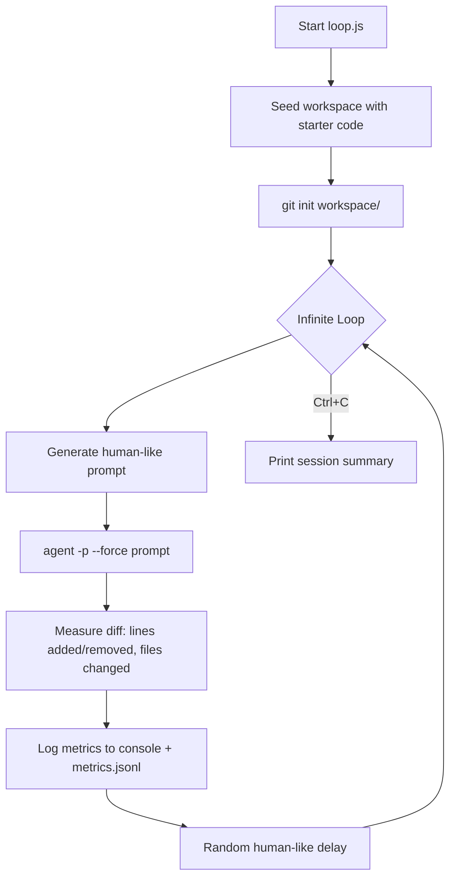

# agentloop

Runs the Cursor CLI agent in an infinite loop, making endless code changes to a workspace for no reason whatsoever.

The agent seeds a small Node.js project, then bombards it with human-sounding prompts — refactors, new features, architectural rewrites — cycling indefinitely until you hit Ctrl+C. Every change is tracked via git diffs and logged to `metrics.jsonl`.

## How it works



Prompts are casual and conversational ("hey can you build out a full state machine module"), rotate across categories (additive, refactoring, expansion, structural), occasionally reference previous changes as follow-ups, and sometimes include typos.

Delays between cycles are randomized to mimic human behavior — sometimes rapid-fire, sometimes a 45-second "coffee break."

## Setup

Requires [Cursor CLI](https://cursor.com/cli) installed and logged in.

```bash
curl https://cursor.com/install -fsS | bash
```

Then:

```bash
npm install
npm start
```

## Options

```bash
node src/loop.js                        # defaults (gemini-3-flash, random delays)
node src/loop.js --model gpt-5.2        # use a different model
node src/loop.js --delay 5000           # fixed 5s delay instead of random
```

## Output

Each cycle prints the prompt and resulting diff stats:

```
[cycle 1] (additive) yo build out a full state machine module in scheduler/...
  +187 -3 in 5 file(s)
  waiting 4.2s...
[cycle 2] (followup) nice, now add comprehensive tests for everything you just wrote
  +94 -0 in 3 file(s)
  waiting 1.1s...
```

On Ctrl+C you get a session summary:

```
--- session summary ---
cycles:      12
insertions:  +1847
deletions:   -203
files:       47 total changes
duration:    384.2s
avg/cycle:   +153.9 -16.9
metrics logged to metrics.jsonl
```

Per-cycle data is appended to `metrics.jsonl` as newline-delimited JSON.

## Project structure

```
src/
  loop.js       main loop and CLI arg parsing
  prompts.js    prompt generation with human-like language
  metrics.js    git-based diff measurement and JSONL logging
  seed.js       generates starter workspace code
workspace/      agent's playground (gitignored, has its own git repo)
metrics.jsonl   per-cycle stats log (gitignored)
```

## Why

For fun. To see what happens when an AI agent edits code in a loop with no goal.
